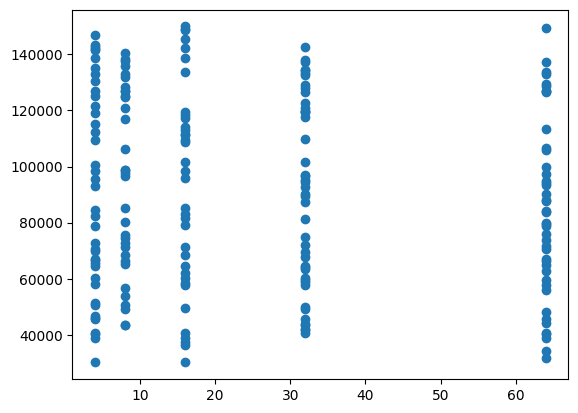
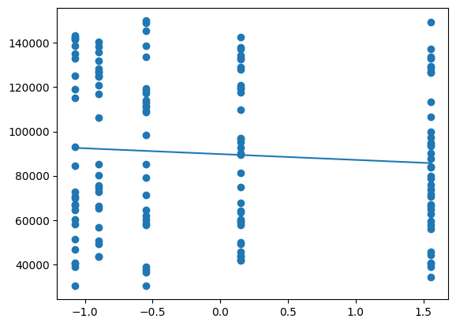

# 💻 Laptop Price Prediction from RAM (Simple Linear Regression)

This project demonstrates how **RAM size (in GB)** can be used to predict the **price of a laptop** using **Simple Linear Regression**.  
It is a minimal case study to understand the limitations of using only one feature for prediction.

---

## 📊 Dataset
The dataset (`Laptop_Price.csv`) contains:

- **RAM_GB**: Laptop RAM size (independent feature)  
- **Price_Rs**: Laptop price in INR (target variable)  

Example rows:

| RAM_GB | Price_Rs  |
|--------|-----------|
| 4      | 35000     |
| 8      | 55000     |
| 16     | 90000     |
| 32     | 150000    |

---

## ⚙️ Steps in the Project
1. **Data Preprocessing**
   - Selected only the `RAM_GB` column as the independent variable.
   - Scaled the feature for training.

2. **Model Training**
   - Used **Linear Regression** from `scikit-learn`.
   - Trained on `x_train` and `y_train`.

3. **Prediction**
   - Predicted the laptop price for **16GB RAM**:
     ```python
     regressor.predict([[16]])
     ```
   - Example Output:  
     ```
     Predicted Price for 16GB RAM ≈ ₹91214.39161576
     ```

---

## 📈 Visualizations

### 🔹 Scatter Plot: RAM vs Price with Regression Line


### 🔹 Predicted vs Actual Prices


---

## ✅ Conclusion
- The model predicts a **16GB RAM laptop costs around ₹92,000** (example result).  
- However, laptop price depends on **many more factors**:
  - Brand (Apple, Dell, HP, etc.)
  - Processor (i3, i5, i7, Ryzen, etc.)
  - GPU availability  
  - Storage (HDD vs SSD)  
  - Screen size & build quality  

👉 **Using only RAM is not enough** for accurate prediction.  
This project shows the **limitation of a univariate regression model** and motivates using **multiple features** for better accuracy.  

---

